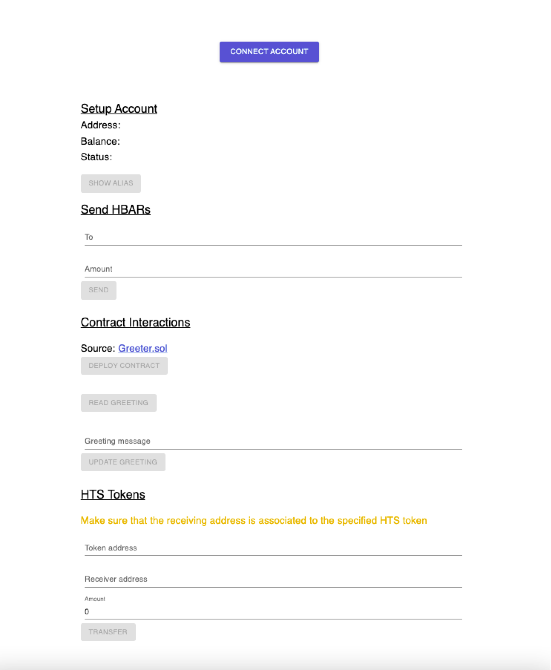
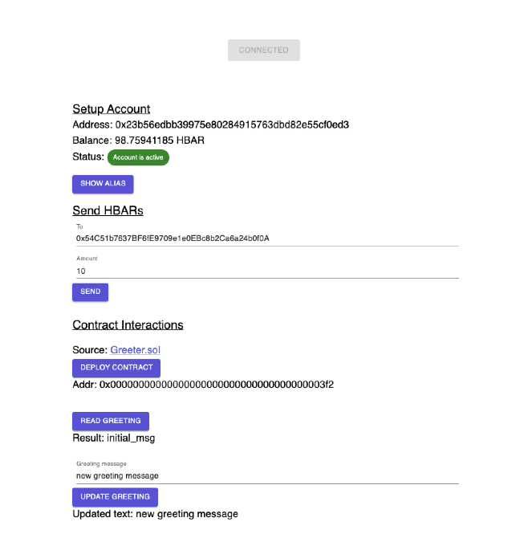
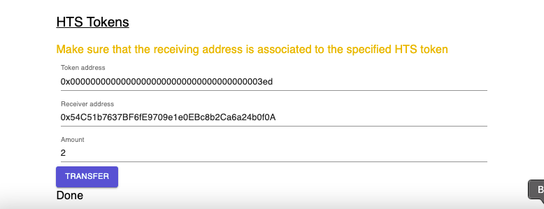

# Dapp example

Simple implementation of React + Metamask + Hedera Hashgraph

## Prerequisite
You must have running:
- JSON-RPC Relay on port :7546
- Hedera Local Node

## Configuration

Create `.env` file based on `.env.example`
```
# example local setup
HEDERA_NETWORK={"127.0.0.1:50211":"0.0.3"}
OPERATOR_ID_MAIN=0.0.2
OPERATOR_KEY_MAIN=302e020100300506032b65700422042091132178e72057a1d7528025956fe39b0b847f200ab59b2fdd367017f3087137
```

## Setup & Install

In the project directory:

1. Run `npm install`
2. Run `npm run bootstrap` - only once to setup accounts, tokens etc.
2. Run `npm run start`

Dapp should be available at [http://localhost:3000](http://localhost:3000)

## Integration Tests
1. Add additional settings to `.env` file - the settings are used by cypress to add new network and accounts to the Metamask(only in the **testing** environment, **NOT** in your real Metamask).
```
# example local setup
NETWORK_NAME='Hedera Local'         # name of the network to be added in metamask
RPC_URL='http://localhost:7546'     # the url of RPC Relay
SYMBOL=HBAR                         # the symbol of native token
CHAIN_ID=298                        # the chain id
IS_TESTNET=false                    # is public testnet
PRIVATE_KEY=                        # private key of the main account
RECEIVER_PRIVATE_KEY=               # private key of the second account
```
2. Run `npm run bootstrap`
3. Run `npm run test`

Available operations:
- [x] Connect with Metamask
- [x] Show connected account's `address` & `balance`
- [x] Sign custom message and extract public key
- [x] Extract `Hedera alias` from public key

- [ ] Transfer HBAR to Hedera alias and activate account -> **Not supported yet**
- [x] Deploy [Greeter](https://github.com/NomicFoundation/hardhat/blob/master/packages/hardhat-core/sample-projects/basic/contracts/Greeter.sol) contract
- [x] View greet message
- [x] Update greet message
- [x] Transfer HTS token to address
- [x] Transfer HBAR tokens

## Screenshots
* *Disconnected account*

* *Connected account with contract interaction*

* *Transfer HTS Tokens*
