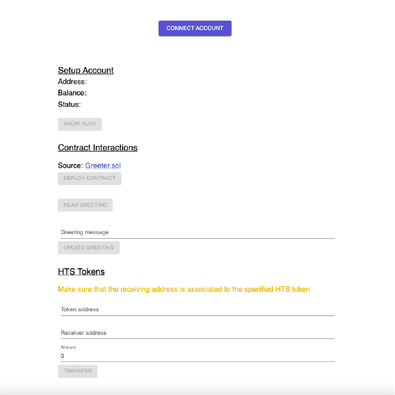

# Dapp example

Simple implementation of React + Metamask + Hedera Hashgraph

## Prerequisite
You must have running:
- JSON-RPC Relay on port :7546
- Hedera Local Node

## Setup & Install

In the project directory, you can run:

1. Run `npm install`
2. Run `npm run bootstrap` - only once to setup accounts, tokens etc.
2. Run `npm run start`

Dapp should be available at [http://localhost:3000](http://localhost:3000)

## Integration Tests
1. Configure .env file
```
NETWORK_NAME=           # name of the network to be added in metamask
RPC_URL=                # the url of RPC Relay
SYMBOL=                 # the symbol of native token
CHAIN_ID=               # the chain id
IS_TESTNET=             # is public testnet
PRIVATE_KEY=            # private key of the main account
RECEIVER_PRIVATE_KEY=   # private key of the receiver account
```
2. Run `npm run bootstrap`
3. Run `npm run test`

Available operations:
- [x] Connect with Metamask
- [x] Show connected account's `address` & `balance`
- [x] Sign custom message and extract public key
- [x] Extract `Hedera alias` from public key

- [ ] Transfer HBAR to Hedera alias and activate account -> **Not supported yet**
- [x] Deploy [Greeter](https://github.com/NomicFoundation/hardhat/blob/master/packages/hardhat-core/sample-projects/basic/contracts/Greeter.sol) contract
- [x] View greet message
- [x] Update greet message
- [x] Transfer HTS token to address
- [x] Transfer HBAR tokens

## Screenshots
