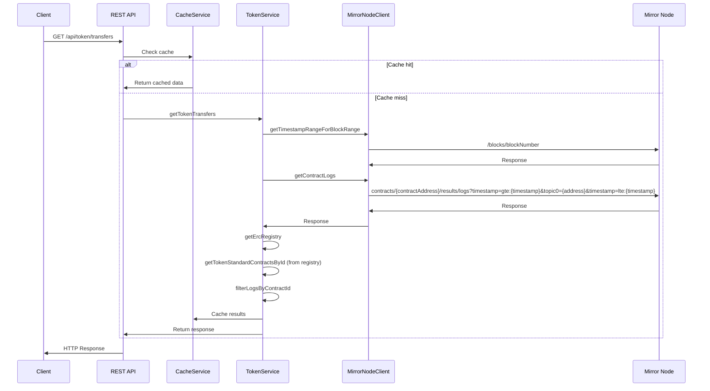

# Block Explorer API Support

## Overview

This document outlines the design for implementing new package for REST API endpoints allowing exposure of more EVM centric data that support Block Explorer (e.g. Etherscan, BlockScout) API needs.

The endpoints will support:
*  ERC20 token transfers 
*  ERC721 NFT transfers
* ERC1155 multi-token transfers (TBD)
*  Tokens owned by an address (TBD)

## Problem Statement

Currently MN doesn't support EVM centric queries, like token transfer events for specific standards like ERC20, ERC721, ERC1155 or balance of an address for a specific token.

## Goals
*  Provide API endpoints to fetch token transfer events
*  Support filtering by sender address
*  Support filtering by receiver address
*  Support filtering by block range
*  Support filtering by specific token contract
*  Support ERC20, ERC721, and ERC1155 token standards
*  Match Etherscan's response format for easy integration
*  Maintain performance with large datasets
*  Provide endpoints to fetch tokens owned by an address

## Non-Goals
*  Support all Blockscout and Etherscan API endpoints
*  Support other events except for Transfer events

## Proposed Solution

Introduce a new package `rest-api` with the following REST endpoints:

| Endpoint | Description 
|----------|-------------|
| `GET /api/token/transfers?standard={standard}&address={address}&contractaddress={contractAddress}&startblock={blockNum}&endblock={blockNum}&page={page}&offset={offset}&sort={asc\|desc}` | Fetch token transfer events 
| `GET /api/account/{address}/tokens?page={page}&offset={offset}` | Fetch tokens owned by an address

The package will be a standalone package with no relay dependencies, its own mirror node client implementation and its own cache service conncting to redis.
This allows for a more modular and scalable solution, with the ability to easily add more endpoints in the future.


https://api.etherscan.io/api?module=account&action=tokentx&contractaddress=0x9f8f72aa9304c8b593d555f12ef6589cc3a579a2&address=0x4e83362442b8d1bec281594cea3050c8eb01311c&page=1&offset=100&startblock=0&endblock=27025780&sort=asc&apikey=MW96VKBCE6WV6TXWK87E4Q12K6BQ5AG9PS
### Package Structure
```
 packages/
   rest-api/
     └── src/
         ├── config/           # Configuration for REST API
         │   ├── index.ts
         │   └── mirrorNode.ts # Mirror Node configuration
         ├── controllers/
         │   ├── tokenController.ts
         │   └── accountController.ts
         ├── routes/
         │   ├── tokenRoutes.ts
         │   └── accountRoutes.ts
         ├── types/
         │   ├── index.ts
         │   └── mirrorNode.ts # Mirror Node types
         ├── services/
         │   ├── cacheService/
         │   │   └── index.ts
         │   ├── tokenService/
         │   │   ├── index.ts
         │   │   └── interfaces.ts
         │   ├── accountService/
         │   │   ├── index.ts
         │   │   └── interfaces.ts
         │   └── mirrorNode/   # Mirror Node client implementation
         │       ├── client.ts
         │       ├── types.ts
         │       └── utils.ts
         ├── middleware/
         │   ├── validation.ts
         │   ├── errorHandler.ts
         │   ├── rateLimiter.ts
         │   └── cache.ts
         ├── app.ts           # Express/Koa app setup
         └── index.ts
     ├── package.json
     └── tsconfig.json
```

### Endpoint `GET /api/token/transfers`

#### Parameters

| Parameter | Description | Required | Default |
|-----------|-------------|----------|---------|
| address | The address (sender or receiver) to filter transfers by | Yes? | - |
| fromBlock | The starting block number | No | 0 |
| toBlock | The ending block number | No | latest |
| contractAddress | The address of the token contract to filter by | No | - |
| standard | The token standard to filter by (ERC20/721/1155) | Yes | - |
| page | The page number if pagination is enabled | No | 1 |
| offset | The number of transfers per page | No | 100 |
| sort | The sort order (asc/desc) | No | desc |

There are three possible cases:
1. Only `contractAddress` is provided
2. Only `address` is provided
3. Both `address` and `contractAddress` are provided


### Main Implementation Components

#### 1. TokenController
Main controller handling HTTP requests:
- Validates request parameters
- Handles response formatting
- Manages error responses
- Implements rate limiting (TBD)
#### 2. TokenService
Core business logic service responsible for handling token-related operations:
- Processes requests by fetching and filtering logs from the Mirror Node based on the provided parameters.
- Handles token standard detection by verifying each contract address against the ERC registry to ensure it implements the requested token standard (ERC20/721/1155).
- Manages data transformation by converting the raw log data into the desired format.
- Returns the response to the TokenController

#### 3. MirrorNodeClient
Custom client for Mirror Node interaction:
- Fetches logs from the Mirror Node
- Returns the logs to the TokenService

#### 4. CacheService
Redis-based caching service:
- Caches frequent queries
- Manages cache invalidation
- Handles cache hits/misses
- Provides consistent caching strategy

### Flow

1. Validate the block range provided in the request and take the timestamp range from the MN
2. Get the logs from the MN for the given timestamp range and filter them by the address and contract address via the topic parameters
3. Filter the results by verifying each contract address from the logs against the ERC registry to ensure it implements the requested token standard (ERC20/721/1155)
4. Transform the logs to the format of the Etherscan API response


#### Sequence Diagram


### Technical Details

#### Example Requests

1. Get ERC20 transfers for an address:
```
GET /api/token/transfers?address=0x123...&startblock=0&endblock=latest&standard=ERC20
```

2. Get ERC721 transfers for a specific contract:
```
GET /api/token/transfers?contractaddress=0x456...&startblock=1000&endblock=2000&standard=ERC721
```

3. Get all token transfers with pagination:
```
GET /api/token/transfers?address=0x123...&page=1&offset=100&sort=desc
```

#### Example Responses

The response format is the same as Etherscan's API response format. 
https://docs.etherscan.io/api-endpoints/accounts#get-a-list-of-erc721-token-transfer-events-by-address


1. Successful Response:
```json
{
  "status": "1",
  "message": "OK",
  "result": [
    {
      "blockNumber": "0x1234",
      "timeStamp": "0x60d21b5d",
      "hash": "0x789...",
      "nonce": "400",
      "blockHash": "0xabc...",
      "from": "0x123...",
      "contractAddress": "0x456...",
      "to": "0x789...",
      "tokenName": "MyToken",
      "tokenSymbol": "MTK",
      "tokenDecimal": "18",
      "transactionIndex": "20",
      "gas": "940000",
      "gasPrice": "32010000000",
      "gasUsed": "77000",
      "cumulativeGasUsed": "12000",
      "confirmations": "not-applicable"
    }
  ]
}
```

2. Error Response (Invalid contract address format):
```json
{
   "status": "0",
   "message": "NOTOK",
   "result": "Error! Invalid contract address format"
}
```

3. Error Response (Invalid address format):
```json
{
   "status": "0",
   "message": "NOTOK",
   "result": "Error! Invalid address format"
}
```

4. No Results:
```json
{
  "status": "0",
  "message": "No transactions found",
  "result": []
}
```

### Performance Considerations

1. Possibly restrict the number of logs returned by the MN to a maximum of 10000
2. Possibly restrict the block range to a maximum of 10000 blocks

### Security Considerations

1. **Input Validation**
   - Validates block ranges
   - Validates address
   - Validates contract addresses


### Testing Requirements

1. **Unit Tests**
   - Test log filtering logic
   - Test address matching
   - Test token standard detection

2. **End-to-End Tests**
   - As a user I want to fetch token transfers for ERC20s for a specific receiver/sender address and a block range
   - As a user I want to fetch token transfers for ERC721s for a specific receiver/sender address and a block range
   - As a user I want to fetch token transfers for ERC1155s for a specific receiver/sender address and a block range
   - As a user I want to fetch token transfers for ERC20s for a specific receiver/sender address and a specific token contract and a block range
   - As a user I want to fetch token transfers for ERC721s for a specific receiver/sender address and a specific token contract and a block range
   - As a user I want to fetch token transfers for ERC1155s for a specific receiver/sender address and a specific token contract and a block range
   - As a user I want to fetch token transfers for ERC20s for a specific specific token contract and a block range
   - As a user I want to fetch token transfers for ERC721s for a specific specific token contract and a block range
   - As a user I want to fetch token transfers for ERC1155s for a specific specific token contract and a block range
   - As a user I want to fetch tokens owned by an address
   - As a user I want to encounter an error when the address is invalid
   - As a user I want to encounter an error when the contract address is invalid
   - As a user I want to encounter an error when the token standard is invalid
   - As a user I want to successfully fetch token transfers for different token standards

3. **Performance Tests**
   - Test with large block ranges
   - Test with high-volume contracts

### Future Improvements


### Dependencies

* ERC registry - As explained in the _Flow_ section, the TokenService will need to fetch the ERC registry to get the token standard (ERC20/721/ 1155) contracts and filter the response by only those matching the standard, wanted in the request. E.g if the request is for ERC20, the TokenService will need to fetch the ERC registry to get the ERC20 contracts and filter the response from the MN by only those matching the standard.


##  `getTokensOwnedByAddress`

### TBD
