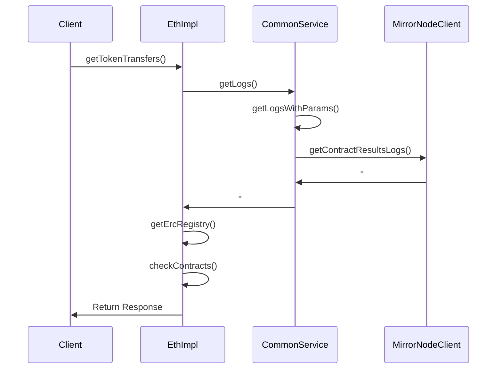

# Design Document: ERC20/ERC721/ERC1155 Token Transfer Events API, Tokens Owned by an Address

## Overview
- This document outlines the design for implementing new endpoints allowing exposure of more EVM centric data, similar to Etherscan's and BlockScout's APIs.
+ The endpoints will support:
+ - ERC20 token transfers 
+ - ERC721 NFT transfers
+ - ERC1155 multi-token transfers
+ - Tokens owned by an address

## Problem Statement
- Currently MN doesn't support EVM centric queries, like token transfer events for specific standards like ERC20, ERC721, ERC1155 or balance of an address for a specific token.

## Goals
- Provide API endpoints to fetch token transfer events
+ - Support filtering by sender address
+ - Support filtering by block range
+ - Support filtering by specific token contract
+ - Support ERC20, ERC721, and ERC1155 token standards
- Match Etherscan's response format for easy integration
- Maintain performance with large datasets
- Provide endpoints to fetch tokens owned by an address

## Proposed Solution

### Overview

Introduce two new endpoints:
- `getTokenTransfers` - to fetch token transfer events
- `getTokensOwnedByAddress` - to fetch tokens owned by an address (TBD)

##  `getTokenTransfers`

### Components

#### 1. EthImpl
Main service class handling token transfer event logic:
- Validates block ranges
- Filters logs for token transfer events
- Checks the contracts in the MN response for the token standard needed
- Transforms logs to transfer events format

#### 2. CommonService Integration
Utilizes existing CommonService for:
- Block range validation
- Timestamp parameter handling

#### 3. MirrorNodeClient Integration
Uses MirrorNodeClient for:
- Fetching contract logs
- Block information retrieval

### Data Flow


### Technical Details

#### API Interfaces

```typescript
interface TokenTransferEvent {
  blockNumber: string;
  timeStamp: string;
  hash: string;
  nonce: number;
  blockHash: string;
  from: string;
  contractAddress: string;
  to: string;
  tokenId?: string;
  tokenName?: string;
  tokenSymbol?: string;
  tokenDecimal?: number;
  transactionIndex: number;
  gas: number;
  gasPrice: number;
  gasUsed: number;
  cumulativeGasUsed: number;
  input: string;
  confirmations: number;
}
```

#### Key Implementation Details

The `getTokenTransfers` endpoint will be calling the same method in the `EthImpl` class which will accept the following parameters:

- `address`: The address to filter transfers by
- `fromBlock`: The starting block number
- `toBlock`: The ending block number
- `contractAddress`: The address of the token contract
- `standard`: The token standard to filter by

There are three possible cases:
1. Only `contractAddress` is provided
2. Only `address` is provided
3. Both `address` and `contractAddress` are provided

1. Validate the block range and take the timestamp range
2. Get the logs from the MN for the given timestamp range and filter them by the address and contract address via the topic parameters
3. Filter the results by checking the contract address returned in the ERC registry and if it matcches the standard
4. Transform the logs to the format of the `TokenTransferEvent` interface


#### Error Handling


### Performance Considerations

1. Possibly restrict the number of logs returned by the MN to a maximum of 10000
2. Possibly restrict the block range to a maximum of 10000 blocks
3. Consider the amount of resources required to check the ERC registry for each log

### Security Considerations

1. **Input Validation**
   - Validates block ranges
   - Validates address
   - Validates contract addresses


### Testing Requirements

1. **Unit Tests**
   - Test log filtering logic
   - Test address matching
   - Test token standard detection

2. **Acceptance Tests**
   - Test Mirror Node interaction
   - Test complete flow with real data
   - Test error scenarios
   - Test different token standards

3. **Performance Tests**
   - Test with large block ranges
   - Test with high-volume contracts

### Future Improvements


### Dependencies

- ERC registry


##  `getTokensOwnedByAddress`

### TBD
