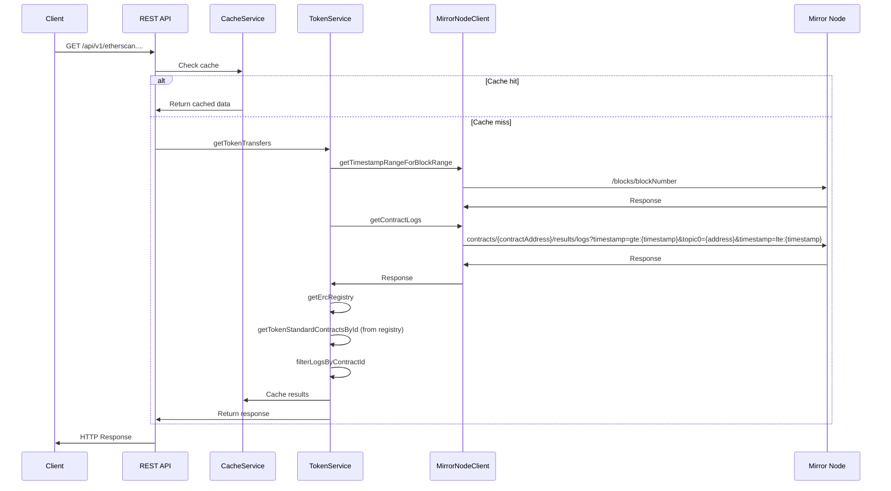

# Block Explorer API Support

## Overview

This document outlines the design for implementing new package for REST API endpoints allowing exposure of more EVM centric data that support Block Explorer (e.g. Etherscan, BlockScout) API needs.

The endpoints will support:
*  ERC20 token transfers 
*  ERC721 NFT transfers
*  ERC1155 multi-token transfers
*  Tokens owned by an address (TBD)

## Problem Statement

Currently MN doesn't support EVM centric queries, like token transfer events for specific standards like ERC20, ERC721, ERC1155 or balance of an address for a specific token.

## Goals
*  Provide API endpoints to fetch token transfer events
*  Support filtering by sender address
*  Support filtering by receiver address
*  Support filtering by block range
*  Support filtering by specific token contract
*  Support ERC20, ERC721, and ERC1155 token standards
*  Match Etherscan's response format for easy integration
*  Maintain performance with large datasets
*  Provide endpoints to fetch tokens owned by an address (TBD)

## Non-Goals
*  Support all Blockscout and Etherscan API endpoints
*  Support other events except for Transfer events
*  Support API key for authorization

## Proposed Solution

Introduce a new package `rest-server` with the following REST endpoints:

**Note: Add v1 to the endpoints (if not breaking partners)**

| Endpoint | Description |
|----------|-------------|
| `GET /api/v1/etherscan?module=account&action=tokentx&address={address}&contractaddress={contractaddress}&startblock={startblock}&endblock={endblock}&page={page}&offset={offset}&sort={asc\|desc}` | Get ERC20 token transfer events |
| `GET /api/v1/etherscan?module=account&action=tokennfttx&address={address}&contractaddress={contractaddress}&startblock={startblock}&endblock={endblock}&page={page}&offset={offset}&sort={asc\|desc}` | Get ERC721 (NFT) token transfer events |
| `GET /api/v1/etherscan?module=account&action=token1155tx&address={address}&contractaddress={contractaddress}&startblock={startblock}&endblock={endblock}&page={page}&offset={offset}&sort={asc\|desc}` | Get ERC1155 token transfer events |
| `GET /api/v1/etherscan/account/{address}/tokens?page={page}&offset={offset}` | Fetch tokens owned by an address |

The package will be a standalone package, but will be using the existing relay package for service implementations.

### Package Structure
```
packages/
├── relay/                    # Core business logic package
│   └── src/
│       └── lib/
│           ├── clients/
│           │   └── mirrorNodeClient.ts
│           └── services/
│               ├── cacheService/
│               │   └── cacheService.ts
│               ├── tokenService/
│               │   ├── index.ts
│               │   └── interfaces.ts
│               └── accountService/
│                   ├── index.ts
│                   └── interfaces.ts
│
└── rest-api/                 # REST API package
    ├── src/
    │   ├── config/          # Configuration
    │   │   ├── index.ts
    │   │   └── mirrorNode.ts
    │   │
    │   ├── controllers/     # Request handlers that will use the services from relay package
    │   │   ├── tokenController.ts
    │   │   └── accountController.ts
    │   │
    │   ├── routes/         # API route definitions
    │   │   ├── tokenRoutes.ts
    │   │   └── accountRoutes.ts
    │   │
    │   ├── types/          # Type definitions
    │   │   └──index.ts
    │   │
    │   ├── middleware/     # HTTP middleware
    │   │   ├── validation.ts
    │   │   ├── errorHandler.ts
    │   │   └── rateLimiter.ts
    │   │
    │   ├── app.ts         # Application setup
    │   └── index.ts       # Entry point
    │
    ├── package.json
    └── tsconfig.json
```

### Configuration Parameters

The `config` folder may contain the following configuration files:

#### 1. `server.ts`
Server-specific configurations:
- `RATE_LIMIT`: Rate limiting configuration
  - `MAX_REQUESTS`: Maximum requests
- `PAGINATION`: Default pagination settings
  - `DEFAULT_PAGE_SIZE`: Default number of items per page (100)
  - `MAX_PAGE_SIZE`: Maximum allowed page size (10000)
- `BLOCK_RANGE`: Block range limitations
  - `MAX_BLOCK_RANGE`: Maximum allowed block range (10000)

#### 2. `cache.ts`
Cache service configurations:
- `REDIS_URL`: Redis server URL
- `REDIS_ENABLED`: Toggle Redis caching
- `REDIS_RECONNECT_DELAY_MS`: Delay for reconnection attempts
- `CACHE_TTL`: TTL configuration
  - `RECENT_BLOCKS_TTL`: TTL for recent blocks (5 minutes)
  - `OLD_BLOCKS_TTL`: TTL for older blocks (1 hour)
  - `RECENT_BLOCKS_THRESHOLD`: Number of recent blocks (100)

### Token Transfer Endpoints

Following Etherscan's API format, we will implement three separate endpoints for different token standards:

1. **ERC20 Token Transfers**
```
GET /api/v1/etherscan
   ?module=account
   &action=tokentx
   &address={address}
   &contractaddress={contractaddress}
   &startblock={startblock}
   &endblock={endblock}
   &page={page}
   &offset={offset}
   &sort={asc|desc}
```

2. **ERC721 Token Transfers (NFTs)**
```
GET /api/v1/etherscan
   ?module=account
   &action=tokennfttx
   &address={address}
   &contractaddress={contractaddress}
   &startblock={startblock}
   &endblock={endblock}
   &page={page}
   &offset={offset}
   &sort={asc|desc}
```

3. **ERC1155 Token Transfers**
```
GET /api/v1/etherscan
   ?module=account
   &action=token1155tx
   &address={address}
   &contractaddress={contractaddress}
   &startblock={startblock}
   &endblock={endblock}
   &page={page}
   &offset={offset}
   &sort={asc|desc}
```

#### Parameters

| Parameter | Description | Required | Default |
|-----------|-------------|----------|---------|
| module | The API module (always "account") | Yes | - |
| action | The endpoint action (tokentx/tokennfttx/token1155tx) | Yes | - |
| address | The address (sender or receiver) to filter transfers by | Yes | - |
| contractaddress | The token contract address to filter by | No | - |
| startblock | The starting block number | No | 0 |
| endblock | The ending block number | No | latest |
| page | The page number if pagination is enabled | No | 1 |
| offset | The number of transfers per page | No | 100 |
| sort | The sort order (asc/desc) | No | desc |

There are three possible cases:
1. Only `contractaddress` is provided
2. Only `address` is provided
3. Both `address` and `contractAddress` are provided


### Main Implementation Components

#### 1. TokenController
Main controller handling HTTP requests:
- Validates request parameters
- Handles response formatting
- Manages error responses
- Implements rate limiting (TBD)

#### 2. TokenService
Core business logic service responsible for handling token-related operations:
- Processes requests by fetching and filtering logs from the Mirror Node based on the provided parameters.
- Handles token standard detection by verifying each contract address against the ERC registry to ensure it implements the requested token standard (ERC20/721/1155).
- Manages data transformation by converting the raw log data into the desired format.
- Returns the response to the TokenController

#### 3. CacheService

Redis-based caching service using the existing implementation in the relay package:
- Caches frequent queries
- Manages cache invalidation
- Handles cache hits/misses
- Provides consistent caching strategy

For optimal performance and efficiency, only the following essential fields from the Mirror Node logs response will be cached:
- `address`: The contract address
- `contract_id`: The contract identifier
- `data`: The log data
- `index`: The log index
- `topics`: The log topics
- `blockNumber`: The block number

This selective caching approach ensures minimal memory usage while maintaining all necessary information for the API responses.

#### Cache TTL Strategy

The Time To Live (TTL) for cached logs can be set based on the following rules:
- Recent blocks (last 100 blocks): 5 minutes TTL
- Older blocks: 1 hour TTL

This tiered approach was chosen based on several key factors:

**Recent Blocks (5 minutes TTL)**:
- Matches high query frequency for recent transactions
- Provides optimal memory usage by not over-caching recent data
- Significantly reduces Mirror Node load during high-traffic periods

**Older Blocks (1 hour TTL)**:
- Optimizes resource usage by reducing recomputation of unchanged data
- Users don't usually query older blocks, so the cache is not used as much

### Flow
1. Validate the block range provided in the request and take the timestamp range from the MN
2. Get the logs from the MN for the given timestamp range and filter them by the address and contract address via the topic parameters
3. Filter the results by verifying each contract address from the logs against the ERC registry to ensure it implements the requested token standard (ERC20/721/1155)
4. Transform the logs to the format of the Etherscan API response

#### Sequence Diagram


### Technical Details

#### Example Requests

1. Get ERC20 transfers for an address:
```
GET /api/v1/etherscan
   ?module=account
   &action=tokentx
   &address=0x123...
   &startblock=0
   &endblock=latest
   &page=1
   &offset=100
   &sort=desc
```

2. Get ERC721 (NFT) transfers for a specific contract:
```
GET /api/v1/etherscan
   ?module=account
   &action=tokennfttx
   &address=0x123...
   &contractaddress=0x456...
   &startblock=1000
   &endblock=2000
   &page=1
   &offset=100
```

3. Get ERC1155 transfers with specific parameters:
```
GET /api/v1/etherscan
   ?module=account
   &action=token1155tx
   &address=0x123...
   &contractaddress=0x789...
   &startblock=5000
   &endblock=latest
   &page=2
   &offset=50
   &sort=asc
```

#### Example Responses

The response format is the same as Etherscan's API response format. 
https://docs.etherscan.io/api-endpoints/accounts#get-a-list-of-erc721-token-transfer-events-by-address


1. Successful Response:
```json
{
  "status": "1",
  "message": "OK",
  "result": [
    {
      "blockNumber": "0x1234",
      "timeStamp": "0x60d21b5d",
      "hash": "0x789...",
      "nonce": "400",
      "blockHash": "0xabc...",
      "from": "0x123...",
      "contractAddress": "0x456...",
      "to": "0x789...",
      "tokenId": "1",
      "tokenName": "MyToken",
      "tokenSymbol": "MTK",
      "tokenDecimal": "18",
      "transactionIndex": "20",
      "gas": "940000",
      "gasPrice": "32010000000",
      "gasUsed": "77000",
      "cumulativeGasUsed": "12000",
      "confirmations": "not-applicable"
    }
  ]
}
```

2. Error Response (Invalid contract address format):
```json
{
   "status": "0",
   "message": "NOTOK",
   "result": "Error! Invalid contract address format"
}
```

3. Error Response (Invalid address format):
```json
{
   "status": "0",
   "message": "NOTOK",
   "result": "Error! Invalid address format"
}
```

4. No Results:
```json
{
  "status": "0",
  "message": "No transactions found",
  "result": []
}
```

### Performance Considerations

1. Possibly restrict the number of logs returned by the MN to a maximum of 100 (as is the MN limit)
2. Possibly restrict the block range to a maximum of 10000 blocks

### Security Considerations

1. **Input Validation**
   - Validates block ranges
   - Validates address
   - Validates contract addresses


### Testing Requirements

1. **Unit Tests**
   - Test log filtering logic
   - Test address matching
   - Test token standard detection

2. **End-to-End Tests**
   - As a user I want to fetch token transfers for ERC20s for a specific receiver/sender address and a block range
   - As a user I want to fetch token transfers for ERC721s for a specific receiver/sender address and a block range
   - As a user I want to fetch token transfers for ERC1155s for a specific receiver/sender address and a block range
   - As a user I want to fetch token transfers for ERC20s for a specific receiver/sender address and a specific token contract and a block range
   - As a user I want to fetch token transfers for ERC721s for a specific receiver/sender address and a specific token contract and a block range
   - As a user I want to fetch token transfers for ERC1155s for a specific receiver/sender address and a specific token contract and a block range
   - As a user I want to fetch token transfers for ERC20s for a specific specific token contract and a block range
   - As a user I want to fetch token transfers for ERC721s for a specific specific token contract and a block range
   - As a user I want to fetch token transfers for ERC1155s for a specific specific token contract and a block range
   - As a user I want to fetch tokens owned by an address
   - As a user I want to encounter an error when the address is invalid
   - As a user I want to encounter an error when the contract address is invalid
   - As a user I want to encounter an error when the token standard is invalid
   - As a user I want to successfully fetch token transfers for different token standards

3. **Performance Tests**
   - Test with large block ranges
   - Test with high-volume contracts
   - Rate limiting
   - Add k6 tests

### Future Improvements

* Keep monitoring etherscan and blockscout for new endpoints and add them to the package

### Dependencies

* ERC registry - As explained in the _Flow_ section, the TokenService will need to fetch the ERC registry to get the token standard (ERC20/721/ 1155) contracts and filter the response by only those matching the standard, wanted in the request. E.g if the request is for ERC20, the TokenService will need to fetch the ERC registry to get the ERC20 contracts and filter the response from the MN by only those matching the standard. Initially, the registry will be used as a static file from the smart contracts repo, but in the future it will be imported as package and used like that.


##  `getTokensOwnedByAddress`

### TBD
