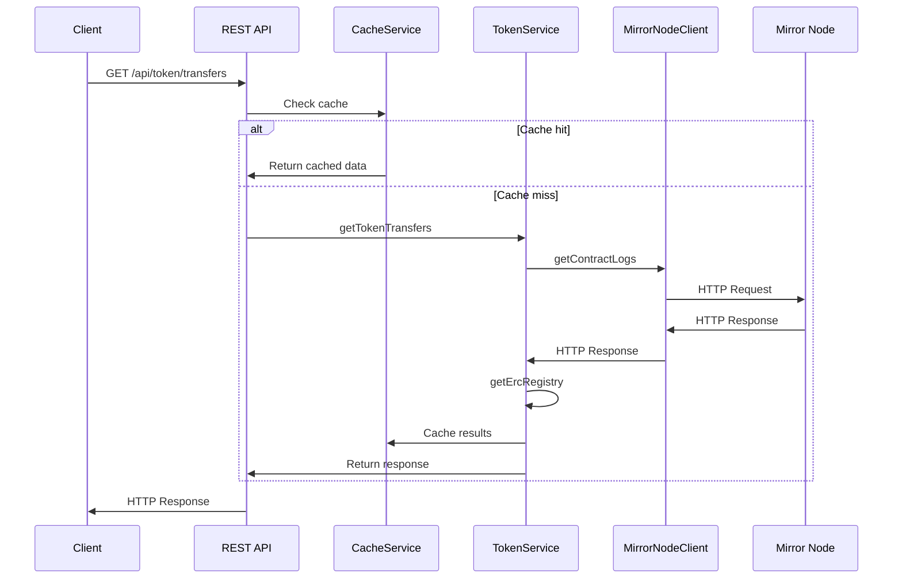

# Block Explorer API Support

## Overview

This document outlines the design for implementing new package for REST API endpoints allowing exposure of more EVM centric data that support Block Explorer (e.g. Etherscan, BlockScout) API needs.

The endpoints will support:
*  ERC20 token transfers 
*  ERC721 NFT transfers
* ERC1155 multi-token transfers (TBD)
*  Tokens owned by an address (TBD)

## Problem Statement

Currently MN doesn't support EVM centric queries, like token transfer events for specific standards like ERC20, ERC721, ERC1155 or balance of an address for a specific token.

## Goals
*  Provide API endpoints to fetch token transfer events
*  Support filtering by sender address
*  Support filtering by block range
*  Support filtering by specific token contract
*  Support ERC20, ERC721, and ERC1155 token standards
*  Match Etherscan's response format for easy integration
*  Maintain performance with large datasets
*  Provide endpoints to fetch tokens owned by an address

## Non-Goals
*  Support all Blockscout and Etherscan API endpoints
*  Support other events except for Transfer events

## Proposed Solution

Introduce a new package `rest-api` with two new REST endpoints:

- `GET /api/token/transfers?standard={standard}&address={address}&contractaddress={contractAddress}&startblock={blockNum}&endblock={blockNum}&page={page}&offset={offset}&sort={asc|desc}` - to fetch token transfer events
- `GET /api/account/{address}/tokens?page={page}&offset={offset}` - to fetch tokens owned by an address (TBD)

The package will be a standalone package with no relay dependencies, its own mirror node client implementation and its own cache service conncting to redis.
This allows for a more modular and scalable solution, with the ability to easily add more endpoints in the future.

### Package Structure
```
 packages/
   rest-api/
     └── src/
         ├── config/           # Configuration for REST API
         │   ├── index.ts
         │   └── mirrorNode.ts # Mirror Node configuration
         ├── controllers/
         │   ├── tokenController.ts
         │   └── accountController.ts
         ├── routes/
         │   ├── tokenRoutes.ts
         │   └── accountRoutes.ts
         ├── types/
         │   ├── index.ts
         │   └── mirrorNode.ts # Mirror Node types
         ├── services/
         │   ├── cacheService/
         │   │   └── index.ts
         │   ├── tokenService/
         │   │   ├── index.ts
         │   │   └── interfaces.ts
         │   ├── accountService/
         │   │   ├── index.ts
         │   │   └── interfaces.ts
         │   └── mirrorNode/   # Mirror Node client implementation
         │       ├── client.ts
         │       ├── types.ts
         │       └── utils.ts
         ├── middleware/
         │   ├── validation.ts
         │   ├── errorHandler.ts
         │   ├── rateLimiter.ts
         │   └── cache.ts
         ├── app.ts           # Express/Koa app setup
         └── index.ts
     ├── package.json
     └── tsconfig.json
```

### Endpoint `GET /api/token/transfers`

### Main Components

#### 1. TokenController
Main controller handling HTTP requests:
- Validates request parameters
- Handles response formatting
- Manages error responses
- Implements rate limiting (TBD)

#### 2. TokenService
Core business logic service:
- Processes token transfer requests
- Handles token standard detection
- Manages data transformation
- Coordinates with other services

#### 3. MirrorNodeClient
Custom client for Mirror Node interaction:
- Handles HTTP requests to Mirror Node

#### 4. CacheService
Redis-based caching service:
- Caches frequent queries
- Manages cache invalidation
- Handles cache hits/misses
- Provides consistent caching strategy

### Flow

1. Validate the block range provided in the request and take the timestamp range from the MN
2. Get the logs from the MN for the given timestamp range and filter them by the address and contract address via the topic parameters
3. Filter the results by verifying each contract address from the logs against the ERC registry to ensure it implements the requested token standard (ERC20/721/1155)
4. Transform the logs to the format of the `TokenTransferEvent` interface

#### Sequence Diagram


### Technical Details

#### Example Requests

1. Get ERC20 transfers for an address:
```
GET /api?module=token&action=transfers&address=0x123...&startblock=0&endblock=latest&standard=ERC20
```

2. Get ERC721 transfers for a specific contract:
```
GET /api?module=token&action=transfers&contractaddress=0x456...&startblock=1000&endblock=2000&standard=ERC721
```

3. Get all token transfers with pagination:
```
GET /api?module=token&action=transfers&address=0x123...&page=1&offset=100&sort=desc
```

#### Example Responses

1. Successful Response:
```json
{
  "status": "1",
  "message": "OK",
  "result": [
    {
      "blockNumber": "0x1234",
      "timeStamp": "0x60d21b5d",
      "hash": "0x789...",
      "nonce": "0x1",
      "blockHash": "0xabc...",
      "from": "0x123...",
      "contractAddress": "0x456...",
      "to": "0x789...",
      "tokenId": "0x1",
      "tokenName": "MyToken",
      "tokenSymbol": "MTK",
      "tokenDecimal": "18",
      "transactionIndex": "0x1",
      "gas": "0x1234",
      "gasPrice": "0x1234",
      "gasUsed": "0x1234",
      "cumulativeGasUsed": "0x1234",
      "input": "0x...",
      "confirmations": "0x1234"
    }
  ]
}
```

2. Error Response:
```json
{
  "status": "0",
  "message": "Invalid address format",
  "result": []
}
```

3. No Results:
```json
{
  "status": "0",
  "message": "No transfers found",
  "result": []
}
```

#### API Interfaces

```typescript
interface TokenTransferEvent {
  blockNumber: string;
  timeStamp: string;
  hash: string;
  nonce: number;
  blockHash: string;
  from: string;
  contractAddress: string;
  to: string;
  tokenId?: string;
  tokenName?: string;
  tokenSymbol?: string;
  tokenDecimal?: number;
  transactionIndex: number;
  gas: number;
  gasPrice: number;
  gasUsed: number;
  cumulativeGasUsed: number;
  input: string;
  confirmations: number;
}
```

#### Key Implementation Details

The `getTokenTransfers` endpoint will be calling the same method in the `EthImpl` class which will accept the following parameters:

- `address`: The address to filter transfers by
- `fromBlock`: The starting block number
- `toBlock`: The ending block number
- `contractAddress`: The address of the token contract
- `standard`: The token standard to filter by

There are three possible cases:
1. Only `contractAddress` is provided
2. Only `address` is provided
3. Both `address` and `contractAddress` are provided


#### Error Handling


### Performance Considerations

1. Possibly restrict the number of logs returned by the MN to a maximum of 10000
2. Possibly restrict the block range to a maximum of 10000 blocks
3. Consider the amount of resources required to check the ERC registry for each log

### Security Considerations

1. **Input Validation**
   - Validates block ranges
   - Validates address
   - Validates contract addresses


### Testing Requirements

1. **Unit Tests**
   - Test log filtering logic
   - Test address matching
   - Test token standard detection

2. **Acceptance Tests**
   - Test Mirror Node interaction
   - Test complete flow with real data
   - Test error scenarios
   - Test different token standards

3. **Performance Tests**
   - Test with large block ranges
   - Test with high-volume contracts

### Future Improvements


### Dependencies

- ERC registry


##  `getTokensOwnedByAddress`

### TBD
