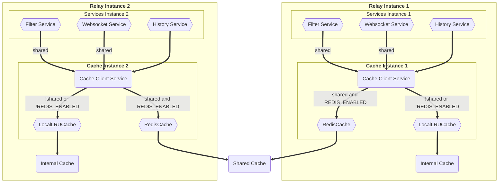
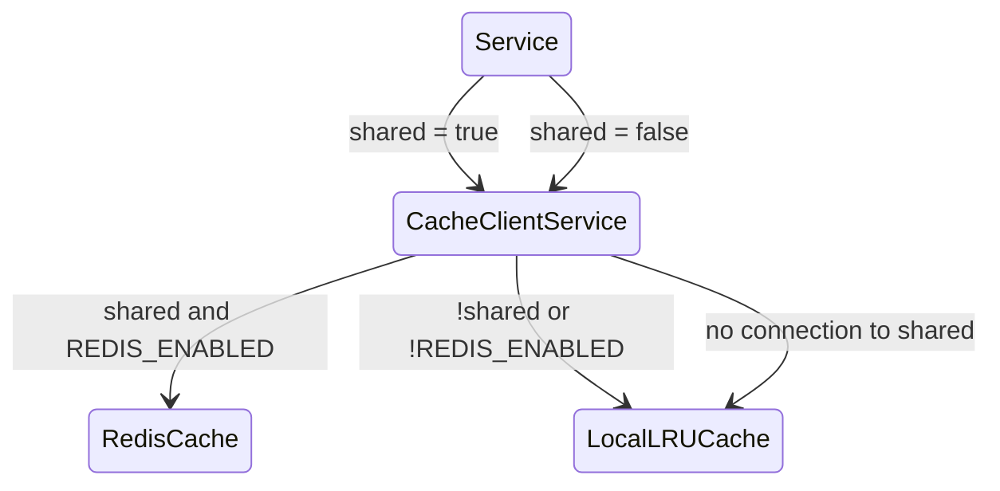

# Distributed cache design

## Purpose

The purpose of a distributed cache is to improve the performance and scalability of JSON-RPC Relay by storing frequently accessed data in memory, making it readily available for quick retrieval by all running instances. This will help functionality like Filter API to work properly as it's heavily dependent on cache.

## Goals

1. **Scalability**: Distributed caches can be used to distribute the load across multiple instances of an application. As the application scales, the cache can help maintain consistent performance by providing a shared data store that all instances can access.
2. **Improved Performance**: By sharing cache accross multiple JSON-RPC Relay instances, correct data will always be available to access upon requests for methods like `eth_subscribe` or services like Filter API, which require shared cache to function correctly.
3. **Reduced Load on Mirror-Node**: By caching data and serving it directly from the cache, the load on the underlying data sources (such as Mirror-Node) is reduced. This can help prevent performance bottlenecks and overloading of these resources.

## Architecture

For distributed cache JSON-RPC Relay will be using Redis and in order to establish connection and manage, it needs to utilize `redis` package. All cache managment will be done in the respective cache client, either for the internal `lru-cache` or shared redis, which methods will be defined by an interface. Adding Cache Client Service will help distributing and error handling of the cache clients, this will help by lowering coupling and higher cohesion of the classes, by separating responsibilities. `LocalLruCache` and `RedisCache` classes will be only responsible for getting, setting or deleting items from their respective caches. While the CacheClientService will be responsible for determining from which cache data should be requested or saved, depending on method preference or in the case of a disabled shared cache or loss of connection. By passing it along in the constructor, services will have access to both internal and shared cache. This way depending on the service needs, it can choose which cache is more suitable.
Important details is that, if an operator does not want to use Redis or it went down for some reason, all services are going to use internal `lru-cache` instead.

### Interface

```javascript
interface ICacheClient {
  get(key: string, callingMethod: string, requestIdPrefix?: string): any;
  set(key: string, value: any, callingMethod: string, ttl?: number, requestIdPrefix?: string): void;
  delete(key: string, callingMethod: string, requestIdPrefix?: string): void;
  clear(): void;
}
```

### Clases

```javascript
class LocalLRUCache implements ICacheClient{
    /**
     * The LRU cache used for caching items from requests.
     *
     * @private
     */
    private readonly cache;

    public constructor() {
        this.cache = new LRU(this.options);
    }
    get(key: string, callingMethod: string, requestIdPrefix?: string) {
        // Get item from internal cache implementation
    }

    set(key: string, value: any, callingMethod: string, ttl?: number, requestIdPrefix?: string) {
        // Set item to internal cache implementation
    }

    delete(key: string, callingMethod: string, requestIdPrefix?: string) {
        // Delete item from internal cache implementation
    }

    private purgeStale() {
        // Delete any stale entries implementation.
    }

    clear() {
        // Clear the cache entirely implementation.
    }
}
```

```javascript
import { createClient } from 'redis';

class RedisCache implements ICacheClient{
    /**
     * The Redis cache used for caching items from requests.
     *
     * @private
     */
    private readonly cache;

    public constructor() {
        const client = createClient({
            url: ''
        });
        await client.connect();

        this.cache = client;
    }
    get(key: string, callingMethod: string, requestIdPrefix?: string) {
        // Get item from shared cache implementation
    }

    set(key: string, value: any, callingMethod: string, ttl?: number, requestIdPrefix?: string) {
        // Set item to shared cache implementation
    }

    delete(key: string, callingMethod: string, requestIdPrefix?: string) {
        // Delete item from shared cache implementation
    }

    clear() {
        // Clear the cache entirely implementation.
    }
}
```

```javascript
class CacheClientService{
    /**
     * The LRU cache used for caching items from requests.
     *
     * @private
     */
    private readonly internalCache;

    /**
     * The Redis cache used for caching items from requests.
     *
     * @private
     */
    private readonly sharedCache;

    public constructor() {
        const internalCache = new LocalLRUCache();
        const sharedCache = new RedisCache();
    }

    get(key: string, callingMethod: string, requestIdPrefix?: string, shared: boolean = false) {
        // Depending on the shared boolean, this method decide from where it should request the data.
        // Fallbacks to internalCache in case of error from the shared cache.
        // Getting from shared cache depends on REDIS_ENABLED env. variable
    }

    set(key: string, value: any, callingMethod: string, ttl?: number, requestIdPrefix?: string, shared: boolean = false) {
        // Depending on the shared boolean, this method decide where it should save the data.
        // Fallbacks to internalCache in case of error from the shared cache.
        // Setting to shared cache depends on REDIS_ENABLED env. variable
    }

    delete(key: string, callingMethod: string, requestIdPrefix?: string, shared: boolean = false) {
        // Depending on the shared boolean, this method decide from where it should delete the data.
        // Fallbacks to internalCache in case of error from the shared cache.
        // Deleting from shared cache depends on REDIS_ENABLED env. variable
    }

    clear(shared: boolean = false) {
        // In case of error does NOT fallback to shared cache.
        // Clearing from shared cache depends on REDIS_ENABLED env. variable
    }
}
```

### Flowchart



### State Diagram



## Limits

1. Should distributed cache be enabled. Env. variable `REDIS_ENABLED`.

## Metric Capturing

Capture metrics for the following:

1. Log every service what kind of cache it's using.
2. Each Implementation of ICacheClient will add a label with the type of cache:
   1. service: originating service that uses the cache
   2. method: originating method that uses the cache
   3. keyLabel: a template for the key
   4. cacheType: redis/lru
   5. type: set/get/delete
   6. stateFeature: true/false. Describes if the cache entry is being used as cache or for sharing state storage

## Tests

The following test cases should be covered but additional tests would be welcome.

1. Connecting to the redis server is successful.
2. Fallback to `lru-cache` if redis is not available or respective feature flags are set.
3. Cases where we set a cache.
4. Cases where we get a cache.
5. Cases where we try to get expired or deleted cache.
6. Cases where we delete a cache.
7. Cases where we try to delete non existing cache.
8. More complex acceptance tests, like: call to relay instance 1 which sets cache value, then query for this cache from relay instance 2 and assertion whether it's the appropriate answer.

## Deployment

The Redis cache will need to run in a separate docker container alongside JSON-RPC Relay instances. A feature flag should be set and url specify in order for the relay instances to make connection with the shared cache.
Environment variable are needed for enabling distributed cache - `REDIS_ENABLED` and for specifying cache address - `REDIS_URL`.

## Answered Questions

1. What is the purpose of adding distributed cache ?
2. How will Redis be implemented to coexist with the current `lru-cache` ?
3. What is the whole workflow of cache usage ?

## Tasks (in suggested order):

#### Milestone 1

1. Finalize design document

#### Milestone 2

1. Implement cacheClient class refactor to utilize interface.
2. Add new class for shared cache which uses `redis` package.
3. Add new env. variable to the corresponding files, like env. example, helm charts and more.
4. Refactor `eth_filter` and `eth_subscribe` to use shared cache, when available.

#### Milestone 3

1. Explore current internal cache usage and determine which should be moved to shared.
