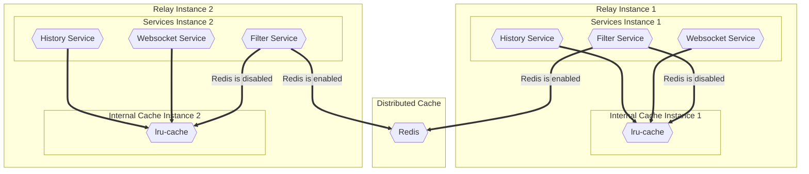

# Distributed cache design

## Purpose

The purpose of a distributed cache is to improve the performance and scalability of JSON-RPC Relay by storing frequently accessed data in memory, making it readily available for quick retrieval by all running instances. This will help functionality like Filter API to work properly as it's heavily dependent on cache.

## Goals

1. **Scalability**: Distributed caches can be used to distribute the load across multiple instances of an application. As the application scales, the cache can help maintain consistent performance by providing a shared data store that all instances can access.
2. **Improved Performance**: By sharing cache accross multiple JSON-RPC Relay instances, correct data will always be available for methods to access upon requests.
3. **Reduced Load on Mirror-Node**: By caching data and serving it directly from the cache, the load on the underlying data sources (such as Mirror-Node) is reduced. This can help prevent performance bottlenecks and overloading of these resources.

## Architecture

For distributed cache JSON-RPC Relay will be using Redis and in order to establish connection and manage, it needs to utilize `node-redis` package. All cache managment will be done in the respective cache client, either for the internal `lru-cache` or shared redis, which methods will be defined by an interface. Using dependency injection pattern with dependency inversion all services that require cache will receive only abstraction in the constructor. This will allow for flexible usage of the cache without additional coupling, depending on the service need.
Important details is that, if an operator does not want to use Redis, it does not need to, because all services that use shared cache will automatically switch to using internal `lru-cache`.

### Diagram



### Interface

```javascript
interface ICacheClient {
  get(key: string, callingMethod: string, requestIdPrefix?: string): any;
  set(key: string, value: any, callingMethod: string, ttl?: number, requestIdPrefix?: string): void;
  delete(key: string, callingMethod: string, requestIdPrefix?: string): void;
  purgeStale(): void;
  clear(): void;
}
```

## Limits

1. Should distributed cache be enabled. Env. variable `REDIS_ENABLED`.

## Metric Capturing

Capture metrics for the following:

1. Log every service what kind of cache it's using.
2. For each service log calls to `get`, `set`, `delete`.

## Tests

The following test cases should be covered but additional tests would be welcome.

1. Connecting to the redis server is sucesfull.
2. Fallback to `lru-cache` if redis is not available or respective feature flags are set.
3. Cases where we set a cache.
4. Cases where we get a cache.
5. Cases where we try to get expired or deleted cache.
6. Cases where we delete a cache.
7. Cases where we try to delete non existing cache.

## Deployment

The Redis cache will need to run in a separate docker container alongside JSON-RPC Relay instances. A feature flag should be set and url specify in order for the relay instances to make connection with the shared cache.
Environment variable are needed for enabling distributed cache - `REDIS_ENABLED` and for specifying cache address - `REDIS_URL`.

## Answered Questions

1. What is the purpose of adding distributed cache ?
2. How will Redis be implemented to coexist with the current `lru-cache` ?
3. What is the whole workflow of cache usage ?

## Tasks (in suggested order):

#### Milestone 1

1. Finalize design document

#### Milestone 2

1. Implement cacheClient class refactor to utilize interface and `node-redis` package.
2. Add new env. variable to the corresponding files, like env. example, helm charts and more.
