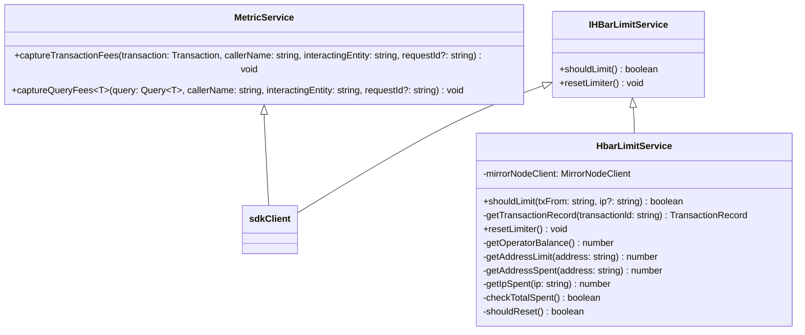

# Hbar limiter service design

## Table of Contents
- [Hbar limiter service design](#hbar-limiter-service-design)
  - [Table of Contents](#table-of-contents)
  - [Purpose](#purpose)
  - [Goals](#goals)
  - [Requirements](#requirements)
    - [Spending Tracking](#spending-tracking)
    - [Spending Limits](#spending-limits)
  - [Architecture](#architecture)
    - [High-Level Design](#high-level-design)
    - [Class Diagram](#class-diagram)
  - [Additional Considerations](#additional-considerations)
    - [Performance](#performance)
    - [Monitoring and logging](#monitoring-and-logging)
  - [Future enhancements](#future-enhancements)

## Purpose

The purpose of the HBar Limiter is to track and control the spending of HBars in real-time across various operations and transaction types. It aims to provide flexible hbar limiting capabilities for relay operators, ensuring efficient resource utilization and preventing potential misuse or drainage of HBars.

## Goals

1. Implement real-time tracking of HBar spending across different operations and transaction types.
2. Provide configurable limiting based on various criteria such as sending address and IP address.
3. Offer tiered access control for different user groups or projects.
4. Enable early detection and prevention of potential HBar drainage.
5. Support flexible alerting mechanisms for spending thresholds.

## Requirements
### Spending Tracking

1. Track HBar spending in real-time.
2. Categorize spending by:
   a. Operation type (e.g., FileAppend, FileCreate)
   b. Transaction type (Ethereum or Hedera)

### Spending Limits

1. Compare current spending against:
   a. Total predefined limit
   b. Current operator balance
2. Support limits based on transaction origin address (`tx.from`).  
   1. Limit based on `tx.from`
   2. Limit based on IP
3. Support tiered spending limits, e.g.:
   - **Tier 1**: Trusted Partners (unlimited)
   - **Tier 2**: Supported projects (higher limit)
   - **Tier 3**: General users (standard limit)

## Architecture

### High-Level Design
The Hbar limiter will be implemented as a separate service, used by other services/classes that need it. It will have two main purposes - to capture the gas fees for different operation and to check if an operation needs to be paused, due to exceeded Hbar limit

### Class Diagram

#### Service Layer

#### Database Layer:

## Additional Considerations
### Performance 

1. Ensure minimal impact on transaction processing times. (Capturing of transaction fees should happen asynchronously behind the scenes)
2. Design for high throughput to handle peak transaction volumes

### Monitoring and logging
1. Use the existing logger in the relay
2. Build on existing dashboards for system health and rate limiting statistics. Add any new metrics to the current dashboards.

## Future enhancements
1. Machine learning-based anomaly detection for unusual spending patterns.
