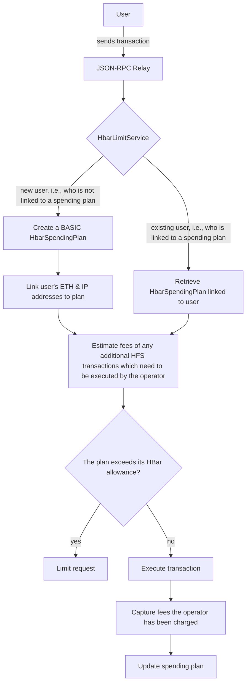
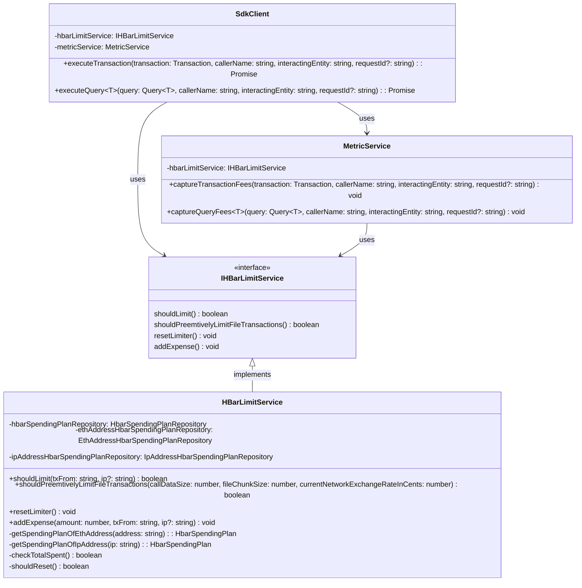

# Hbar limiter service design

## Table of Contents

- [Hbar limiter service design](#hbar-limiter-service-design)
  - [Table of Contents](#table-of-contents)
  - [Purpose](#purpose)
  - [Goals](#goals)
  - [Requirements](#requirements)
    - [Spending Tracking](#spending-tracking)
    - [Spending Limits](#spending-limits)
    - [Early Detection and Prevention (Preemptive Rate Limit)](#early-detection-and-prevention-preemptive-rate-limit)
  - [Architecture](#architecture)
    - [High-Level Design](#high-level-design)
    - [Class Diagram](#class-diagram)
      - [Service Layer](#service-layer)
      - [Database Layer:](#database-layer)
    - [Support flexible alerting mechanisms for spending thresholds](#support-flexible-alerting-mechanisms-for-spending-thresholds)
      - [HBar Allocation Strategy](#hbar-allocation-strategy)
        - [Metrics to Track](#metrics-to-track)
        - [Allocation Algorithm](#allocation-algorithm)
  - [Configurations](#configurations)
    - [Pre-populating the Redis Cache with Spending Plans for Supported Projects and Partner Projects](#pre-populating-the-redis-cache-with-spending-plans-for-supported-projects-and-partner-projects)
    - [Spending Limits of Different Tiers](#spending-limits-of-different-tiers)
    - [Total Budget and Limit Duration](#total-budget-and-limit-duration)
  - [Additional Considerations](#additional-considerations)
    - [Performance](#performance)
    - [Monitoring and logging](#monitoring-and-logging)
  - [Future enhancements](#future-enhancements)

## Purpose

The purpose of the HBar Limiter is to track and control the spending of HBars in real-time across various operations and transaction types. It aims to provide flexible hbar limiting capabilities for relay operators, ensuring efficient resource utilization and preventing potential misuse or drainage of HBars.

## Goals

1. Implement real-time tracking of HBar spending across different operations and transaction types.
2. Provide configurable limiting based on various criteria such as sending address and IP address.
3. Offer tiered access control for different user groups or projects.
4. Enable early detection and prevention of potential HBar drainage.
5. Support flexible alerting mechanisms for spending thresholds.

## Requirements

### Spending Tracking

1. Track HBar spending in real-time.
2. Categorize spending by:
   a. Operation type (e.g., FileAppend, FileCreate)
   b. Transaction type (Ethereum or Hedera)

### Spending Limits

1. Compare current spending against:
   a. Total predefined limit
   b. Current operator balance
2. Support limits based on transaction origin address (`tx.from`).
   1. Limit based on `tx.from`
   2. Limit based on IP
3. Support tiered spending limits, e.g.:
   - **Tier 1**: Trusted Partners (unlimited)
   - **Tier 2**: Supported projects (higher limit)
   - **Tier 3**: General users (standard limit)

### Early Detection and Prevention (Preemptive Rate Limit)

**Preemptive Rate Limiting for HFS Transactions**

1. Calculate the number of potential HFS transactions based on the size of the incoming call data:

   - **File Create:** 1 transaction
   - **File Append:** (size_of_call_data / file_chunk_size) transactions

2. Use the [Hedera Fee Estimator](https://hedera.com/fees) to estimate the costs of each HFS transaction, based on the maximum chunk size configuration (currently set to 5 KB).

3. Calculate the total estimated fee and compare it against the remaining budget to determine if a preemptive rate limit should be applied.

## Architecture

### High-Level Design

The HBar limiter will be implemented as a separate service, used by other services/classes that need it. It will have two main purposes - to capture the gas fees for different operation and to check if an operation needs to be paused, due to an exceeded HBar limit.



### Class Diagram

#### Service Layer



#### Database Layer:


### Support flexible alerting mechanisms for spending thresholds
The existing technical infrastructure, prometheus and grafana will be used to trigger alerts.  At the time of this writing 10K HBar is the maximum the relay operator can spend in one day, on HashIO.

The rest of this section describes addtional metrics that will be added, with alerts later, to track critical balances, and how new values for those tiers in HashIO will
be determined.

The initial spending threshold of the Tier 3 General users will be a rough
estimate based on the current daily spending of the Relay Operator.  In order
to refine this over time a prometheus metric called the `basicSpendingPlanCounter`
will be used to track the number of unique spending plans.  

The metrics listed below will be added to help determine the best Tier 3 General users over time:

1. Daily Unique Users Counter
2. Average Daily Users
3. Dynamic Per-User Limit - Daily budget for the Relay Operator (10K) divided by the average number of users
4. Time-based Allocation - Allocating the Relay Operator's budget throughout the day to prevent early users from consuming all resources
5. User History - Track individual user usage over time to identify and manage heavy users
6. Flexible Limits - Implement a system that can adjust limits based on current usage and time of day
   
#### HBar Allocation Strategy
##### Metrics to Track
1. Daily Unique Users
2. Total HBar Spent per Day
3. Rolling Average of Daily Unique Users (e.g., over 7 or 30 days)
4. Individual User Daily and Monthly Usage
   
##### Allocation Algorithm
1. Base Allocation:
   - Daily Budget / Rolling Average of Daily Unique Users = Base User Limit
  
2. Time-Based Adjustment:
   - Divide the day into time slots (e.g., 6 4-hour slots)
   - Allocate a portion of the daily budget to each slot
   - Adjust user limits based on remaining budget in the current slot

3. Dynamic User Limit:
   - Start with the Base User Limit
   - Adjust based on:
a. User's historical usage (lower limit for consistently heavy users)
b. Time of day (higher limits when usage is typically lower)
c. Current day's usage (increase limits if overall usage is low)

4. Flexible Ceiling:
   - Implement a hard cap (e.g., 2x Base User Limit) to prevent single user from consuming too much

5. Reserve Pool:
   - Keep a small portion of the daily budget (e.g., 10%) as a reserve
   - Use this to accommodate unexpected spikes or high-priority users

## Configurations

### Pre-populating the Redis Cache with Spending Plans for Supported Projects and Partner Projects

The following configurations will be used to automatically populate the Redis cache with `HbarSpendingPlan`, `EthAddressHbarSpendingPlan`, and `IPAddressHbarSpendingPlan` entries for the outlined supported projects and partner projects on every start-up of the relay.

All other users (ETH and IP addresses which are not specified in the configuration file) will be treated as "general users" and will be assigned a basic `HbarSpendingPlan` on their first request and their ETH address and IP address will be linked to that plan for all subsequent requests.

```json
[
  {
    "name": "partner name",
    "ethAddresses": ["0x123", "0x124"],
    "ipAddresses": ["127.0.0.1", "128.0.0.1"],
    "subscriptionTier": "ADVANCED"
  },
  {
    "name": "some other partner that has given us only eth addresses",
    "ethAddresses": ["0x125", "0x126"],
    "subscriptionTier": "ADVANCED"
  },
  {
    "name": "supported project name",
    "ethAddresses": ["0x127", "0x128"],
    "ipAddresses": ["129.0.0.1", "130.0.0.1"],
    "subscriptionTier": "EXTENDED"
  },
  {
    "name": "some other supported project that has given us only ip addresses",
    "ipAddresses": ["131.0.0.1", "132.0.0.1"],
    "subscriptionTier": "EXTENDED"
  }
]
```

On every start-up, the relay will check if these entries are already populated in the Redis cache. If not, it will populate them accordingly. 

The JSON file can also be updated over time to add new supported projects or partner projects and it will populated only the new entries on the next start-up.

```json
[
  ...,
  {
    "name": "new partner name",
    "ethAddresses": ["0x129", "0x130"],
    "ipAddresses": ["133.0.0.1"],
    "subscriptionTier": "ADVANCED"
  }
]
```

### Spending Limits of Different Tiers

The spending limits for different tiers are defined as environment variables:
- `HBAR_RATE_LIMIT_BASIC`: The spending limit (in hbars) for general users (tier 3)
- `HBAR_RATE_LIMIT_EXTENDED`: The spending limit (in hbars) for supported projects (tier 2)
- `HBAR_RATE_LIMIT_PRIVILEGED`: The spending limit (in hbars) for trusted partners (tier 1)

Example configuration for tiered spending limits:
```dotenv
HBAR_RATE_LIMIT_BASIC=1000
HBAR_RATE_LIMIT_EXTENDED=10000
HBAR_RATE_LIMIT_PRIVILEGED=20000
```

### Total Budget and Limit Duration

The total budget and the limit duration are defined as environment variables:
- `HBAR_RATE_LIMIT_DURATION`: The time window (in milliseconds) for which both the total bud
- `HBAR_RATE_LIMIT_TINYBAR`: The ceiling on the total amount of HBars that can be spent in the limit duration.

Example configuration for a daily budget of 15,840,000,000,000 tinybars (15,840 HBars):
```dotenv
HBAR_RATE_LIMIT_TINYBAR=15840000000000
HBAR_RATE_LIMIT_DURATION=86400000
```

## Additional Considerations

### Performance

1. Ensure minimal impact on transaction processing times. (Capturing of transaction fees should happen asynchronously behind the scenes)
2. Design for high throughput to handle peak transaction volumes

### Monitoring and logging

1. Use the existing logger in the relay
2. Build on existing dashboards for system health and rate limiting statistics. Add any new metrics to the current dashboards.

## Future enhancements

1. Machine learning-based anomaly detection for unusual spending patterns.
