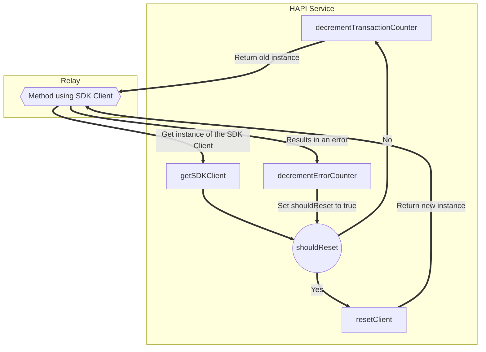

```mermaid
flowchart TD
    subgraph HAPI Service
    B[decrementTransactionCounter]
    C[decrementErrorCounter]
    D((shouldReset))
    E[resetClient]
    F[getSDKClient]
    end
    A ==Get instance of the SDK Client ==>F
    F ==> D
    D ==Yes ==> E
    D ==No ==> B
    E == Return new instance ==> A
    B == Return old instance ==> A
    subgraph Relay
    A{{Method using SDK Client}}
    end
    A == Results in an error ==> C
    C == Set shouldReset to true ==> D
```
