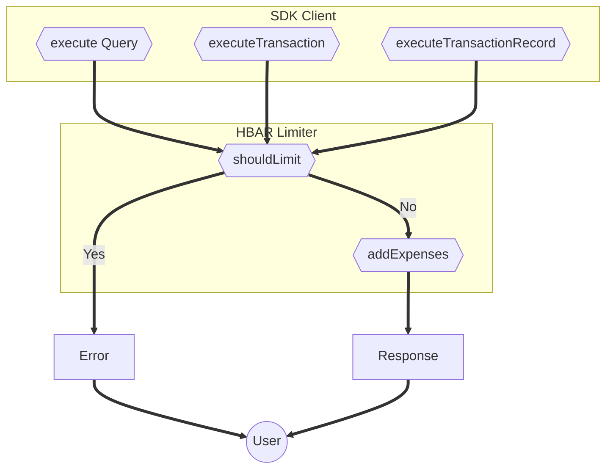

```mermaid
flowchart TD
    subgraph SDK Client
    A{{execute Query}}
    B{{executeTransaction}}
    C{{executeTransactionRecord}}
    end
    A ==> D
    B ==> D
    C ==> D
    subgraph HBAR Limiter
    D{{shouldLimit}}
    E{{addExpenses}}
    end
    D ==No ==> E
    D ==Yes ==> F
    F ==> H
    E ==> G
    G ==> H
    F[Error]
    G[Response]
    H((User))
```
