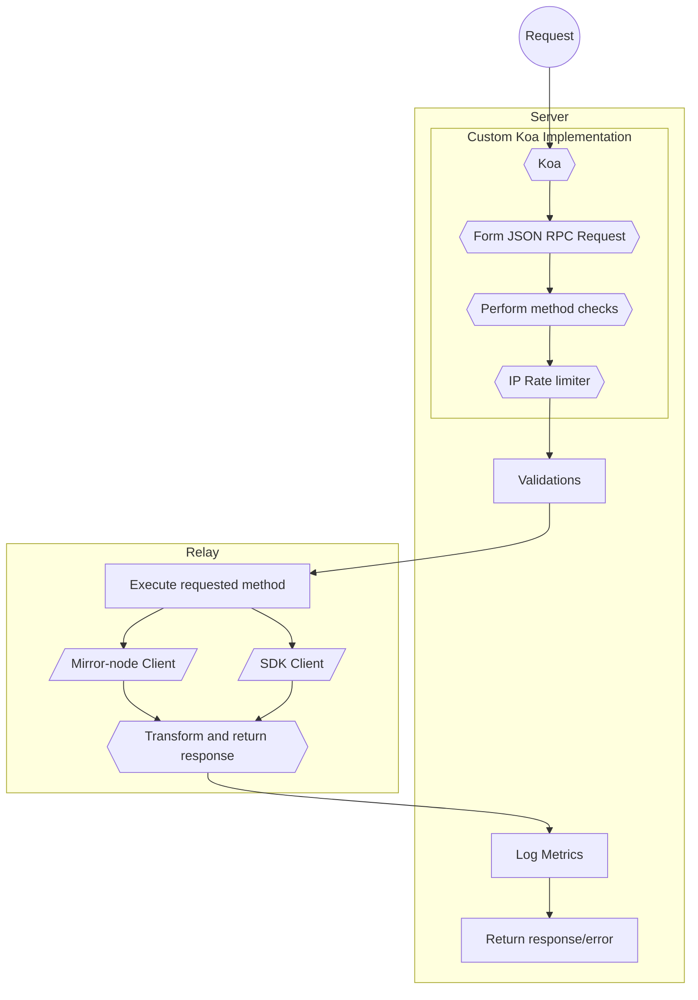

```mermaid
flowchart TD
    A((Request))
    A --> C[Server]
    subgraph Server
    subgraph Custom Koa Implementation
    C{{Koa}}
    D{{Form JSON RPC Request}}
    E{{Perform method checks}}
    F{{IP Rate limiter}}
    C --> D
    D --> E
    E --> F
    end
    F --> G
    I --> J
    end
    G[Validations]
    I[Log Metrics]
    J[Return response/error]
    subgraph Relay
    H[Execute requested method]
    K[/Mirror-node Client/]
    L[/SDK Client/]
    H --> K
    H --> L
    M{{Transform and return response}}
    K --> M
    L --> M
    G --> H
    M --> I
    end
```
