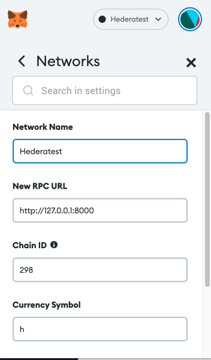
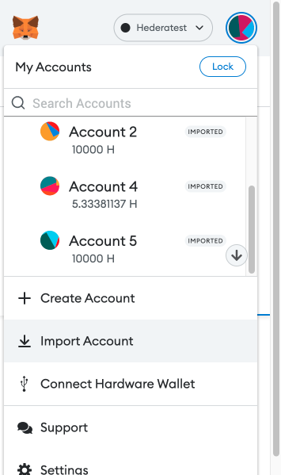

# Transferring Hbar Using the Hedera JSON-RPC Relay

For illustration purposes, Metamask is used but this guide should be applicable to any JSON-RPC enabled wallet.

## Add Hedera Network to Metamask

1. Open Metamask and click on the circle in the upper right corner
2. Select `Settings`->`Networks`->`Add Network`
3. Populate `Network Name` as desired
4. Fill in `New RPC URL` for the relay you are connecting to
5. Enter proper `Chain ID`, ensure no error message is seen and that the id matches
6. Fill in a `Currency Symbol`

The panel should be populated similar to the following:

## Fund creation account
In order to get started you will need to have created a Hedera account with sufficient balance to pay for the following transactions.

## Create Aliased Hedera Accounts
Aliased accounts matching the private keys will need to be created in order to properly sign transactions. 

You can create an aliased account by executing [account-alias-ecdsa.js](examples/account-alias-ecdsa.js). You will need to setup your `.env` file with you account id and private key. It is not recommended to run this on mainnet as this will print private keys to the command line. This is for demonstration purposes only.

Record the raw private keys that are printed to the command line.

## Import Account into Metamask

Repeat this process for every account you wish to import:

1. Copy the raw private key of an account to be imported
2. Click on the circle in the upper right corner
3. Select `Import Account`

4. Paste your private key into the field and click `Import`

5. Verify that the balance loads successfully

## Send Hbar
1. Open the receiving account in metamask and copy the address using the button below the account nickname
2. Go to the sending account and click `Send`
3. Paste the address into the `Send to` bar
4. Enter in a valid amount to send to the account into the `Amount` field and click `Next`
5. Click `Confirm` on the next page
6. Wait a few seconds for the transaction to confirm and verify the updated balance in the sending/receiving account.