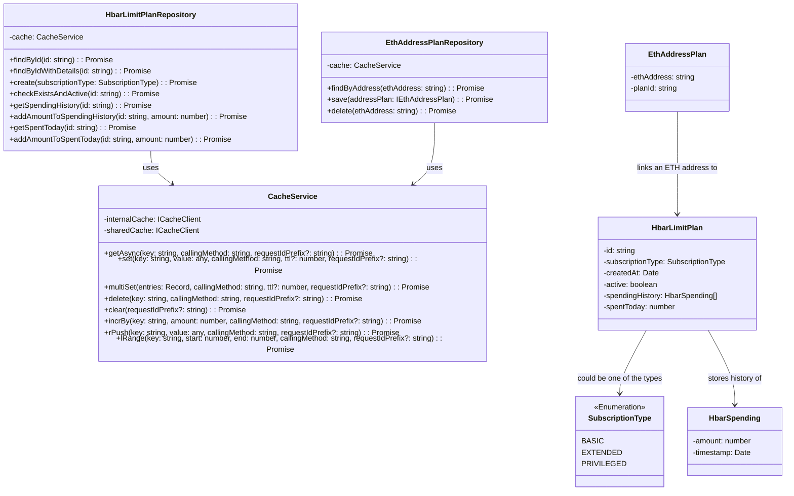

```mermaid
classDiagram
    class CacheService {
        -internalCache: ICacheClient
        -sharedCache: ICacheClient
        +getAsync<T>(key: string, callingMethod: string, requestIdPrefix?: string): Promise<T>
        +set(key: string, value: any, callingMethod: string, ttl?: number, requestIdPrefix?: string): Promise<void>
        +multiSet(entries: Record<string, any>, callingMethod: string, ttl?: number, requestIdPrefix?: string): Promise<void>
        +delete(key: string, callingMethod: string, requestIdPrefix?: string): Promise<void>
        +clear(requestIdPrefix?: string): Promise<void>
        +incrBy(key: string, amount: number, callingMethod: string, requestIdPrefix?: string): Promise<number>
        +rPush(key: string, value: any, callingMethod: string, requestIdPrefix?: string): Promise<number>
        +lRange<T>(key: string, start: number, end: number, callingMethod: string, requestIdPrefix?: string): Promise<T[]>
    }

    class HbarLimitPlan {
        -id: string
        -subscriptionType: SubscriptionType
        -createdAt: Date
        -active: boolean
        -spendingHistory: HbarSpending[]
        -spentToday: number
    }

    class EthAddressPlan {
        -ethAddress: string
        -planId: string
    }

    class HbarSpending {
        -amount: number
        -timestamp: Date
    }

    class HbarLimitPlanRepository {
        -cache: CacheService
        +findById(id: string): Promise<IHbarLimitPlan>
        +findByIdWithDetails(id: string): Promise<IDetailedHbarLimitPlan>
        +create(subscriptionType: SubscriptionType): Promise<IDetailedHbarLimitPlan>
        +checkExistsAndActive(id: string): Promise<void>
        +getSpendingHistory(id: string): Promise<IHbarSpending[]>
        +addAmountToSpendingHistory(id: string, amount: number): Promise<number>
        +getSpentToday(id: string): Promise<number>
        +addAmountToSpentToday(id: string, amount: number): Promise<void>
    }

    class EthAddressPlanRepository {
        -cache: CacheService
        +findByAddress(ethAddress: string): Promise<IEthAddressPlan>
        +save(addressPlan: IEthAddressPlan): Promise<void>
        +delete(ethAddress: string): Promise<void>
    }

    class SubscriptionType
    <<Enumeration>> SubscriptionType
    SubscriptionType : BASIC
    SubscriptionType : EXTENDED
    SubscriptionType : PRIVILEGED

    HbarLimitPlan --> SubscriptionType : could be one of the types
    HbarLimitPlan --> HbarSpending : stores history of

    EthAddressPlan --> HbarLimitPlan : links an ETH address to

    HbarLimitPlanRepository --> CacheService : uses

    EthAddressPlanRepository --> CacheService : uses
```
