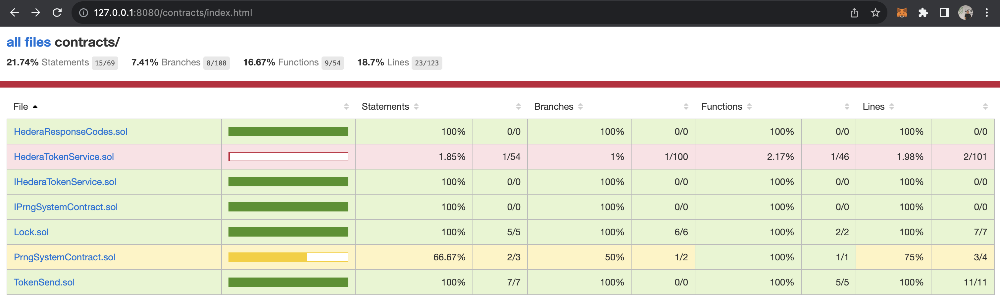
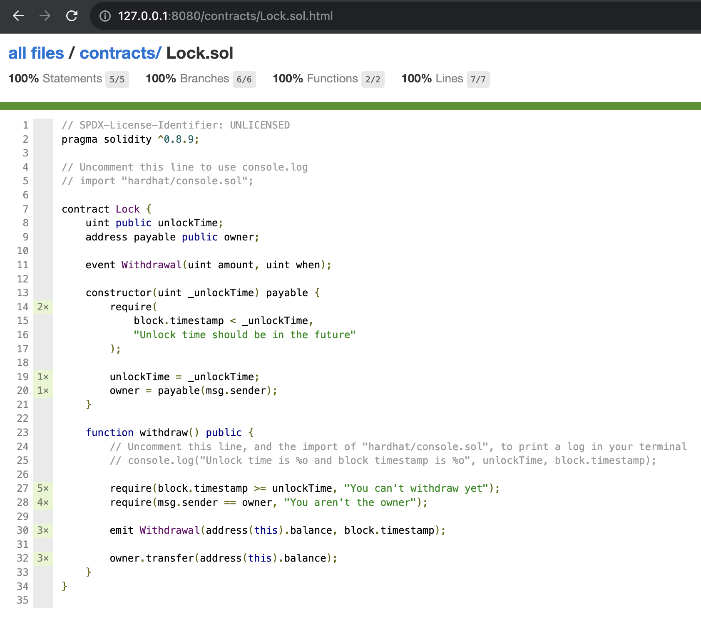
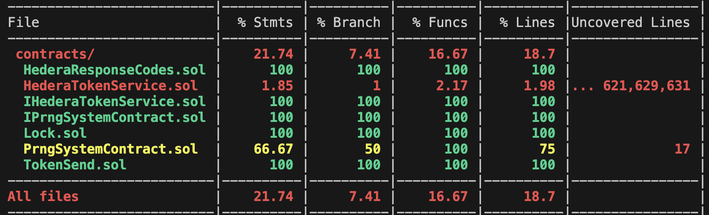

# Sample Hedera/Hardhat/Code coverage Project

This project demonstrates a basic usage of the solidity coverage [plugin](https://github.com/sc-forks/solidity-coverage) of HardHat in a Hedera environment. Example comes with simple contract to showcase this functionality, as well as more complex example contract with Hedera Precompile system calls. 

## The integration

You can find a npm script that launches a http server to serve the code coverage report.
But first the reports have to be generated:
```shell
// to run the tests and generate the reports
npm run test
// serve the reports on http://127.0.0.1:8080 by default
npm run coverage:serve
```
You should expect a tree like file explorer.
####  Overview of all your contracts

####  Overview of a single file


Or simply run the stock command 
```shell
// output the code covarage report in the console
npx hardhat coverage
```
####  Example console output


### Limitations:
There is a limitation around hardhat using our system contracts at their reserved addresses.
An issue is posted on GitHub -> [link](https://github.com/NomicFoundation/hardhat/issues/4429)
You can look at the issue for more details.

Issue examples can be found in this repo. 
We have a few tests written in the `TokenSend.ts`, and `PrngSystemContract.ts`, files that use the precompile feature.

The code coverage tool seem not to be affected by this issue. The code path branch where the test fails is counted as coverage.
